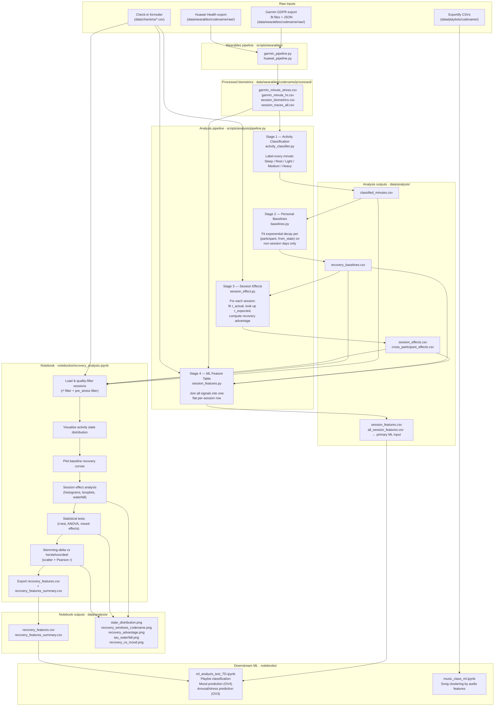

# Recovery Analysis — Project R.E.M.

This document describes the full system behind `notebooks/recovery_analysis.ipynb`: what pipelines run, why each stage exists, what every output file contains, and where it all fits in the research workflow.

---

## The question this system answers

> *"Does listening to music accelerate physiological stress recovery compared to how quickly this person normally recovers — without music — from the same starting state?"*

The answer is computed per session, per participant, using the participant's own biometric history as their personal control group. No population norms. No fixed thresholds. Every comparison is between *that person* with music vs. *that person* without.

---

## Full system flowchart



---

## Stage-by-stage breakdown

### Wearables pipeline — `scripts/wearables/`

**Why it exists:** raw Garmin and Huawei exports are binary (FIT) or proprietary JSON. This pipeline decodes them and produces clean per-minute CSVs that every downstream stage can read.

**What it does:**
- Extracts HR, stress (0–100), body battery (0–100), steps, and activity intensity from `.fit` files and Garmin JSON daily files
- Aligns timestamps to CET (raw FIT times are UTC)
- Produces 7 output types per participant

**Outputs** → `data/wearables/{codename}/processed/`

| File | Contents |
|------|----------|
| `garmin_daily.csv` | Daily aggregates (steps, avg HR, sleep hours) |
| `garmin_minute_stress.csv` | Stress value every minute |
| `garmin_minute_hr.csv` | HR every minute |
| `session_biometrics.csv` | Per-session aggregates: avg HR, BB start/end, peak stress |
| `session_traces_all.csv` | Combined per-minute trace for all sessions |
| `session_traces/{date}.csv` | Individual per-minute trace per session |
| PDF report | Summary visualisation per participant |

> Raw exports are gitignored (`data/wearables/*/raw/`) — they contain participant PII (email, location, profile).

---

### Stage 1 — Activity Classification · `activity_classifier.py`

**Why it exists:** the recovery model needs to know *what the participant was doing before* each transition. A person going from heavy exercise to rest recovers differently from someone going from sleep to rest. Without activity labels, every recovery window would use the same single baseline, masking the real signal.

**What it does:** labels every minute of smartwatch data as one of five states:

| Label | Criteria |
|-------|----------|
| **Sleep** | 22:00–08:00 window, no steps, HR ≤ 95 bpm |
| **Rest** | Awake, sedentary, HR ≤ 78 bpm, < 5 steps/min |
| **Light** | HR > 78 bpm or > 5 steps/min |
| **Medium** | HR > 100 bpm or stress > 50 |
| **Heavy** | HR > 130 bpm or stress > 70 and BB falling fast |

Two edge cases handled explicitly:
- **No-wear gaps** (HR + stress both absent) → classified as `Unknown`, excluded from everything downstream
- **Overnight presumption**: 22:00–08:00 defaults to Sleep unless steps > 0 or HR > 95. This covers REM sleep where HR sits at 75–90 bpm and would otherwise be labelled Rest.

**Known weakness:** thresholds are fixed, not calibrated per person. An athlete hits Heavy at a higher HR than an untrained participant. This affects `pre_state` classification and thereby `τ_expected` lookups in Stage 3. Planned fix: train a Random Forest on Garmin's own FIT `intensity` labels (see Suggestions).

**Output** → `data/analysis/{codename}/classified_minutes.csv`

| Column | Example |
|--------|---------|
| `timestamp` | 2025-01-29 07:14:00 |
| `activity_state` | Sleep |
| `hr` | 68 |
| `stress` | 31 |
| `body_battery` | 72 |

---

### Stage 2 — Personal Baselines · `baselines.py`

**Why it exists:** to answer "how fast does *this person* normally recover from *this kind of effort*?" — the personalised reference curve that every session is compared against.

**What it does:**
1. Filters to **non-session days only** (sessions are excluded so music doesn't contaminate the baseline)
2. Detects state transitions (e.g. Medium → Rest) in the activity labels from Stage 1
3. For each transition, extracts a 90-minute post-transition window of HR, stress, and body battery
4. Fits an exponential decay curve to each window: `f(t) = asymptote + (start − asymptote) × e^(−t/τ)`
5. Takes the **median τ** across all windows per `(participant, from_state, signal)` — median rather than mean to limit the influence of outlier windows

**Transition quality filter:** the prior state must have held for ≥ 3 consecutive minutes before the transition is counted. This prevents single-minute HR spikes from generating hundreds of low-quality windows.

**Key output concepts:**

| Term | What it is |
|------|-----------|
| `asymptote` | Personal stress floor for this state — the value the signal converges to. Fixed per (participant, from_state). Not a session average. |
| `tau_min` | Median time constant in minutes. Smaller = faster recovery. Fixed per (participant, from_state). Not a session average. |
| `t_90_min` | Minutes to 90% recovery = τ × 2.3 |
| `r_squared` | How well the exponential model fits. r² = 0 for bosbes (stress doesn't follow a clean exponential) — τ is still used as an estimate, but with high uncertainty. |

**Output** → `data/analysis/{codename}/recovery_baselines.csv`

One row per `(from_state, signal)` combination. Three signals: stress, heart_rate, body_battery.

---

### Stage 3 — Session Effect Analysis · `session_effect.py`

**Why it exists:** this is the core measurement — did music change how fast recovery happened in that specific session?

**What it does for each music session:**
1. Looks up the dominant activity state in the 30 minutes before session start → `pre_state`
2. Retrieves `τ_expected` from the Stage 2 baseline for that `(participant, pre_state)`
3. Extracts the stress trace during the session window
4. Fits an exponential decay to that trace → `τ_actual`
5. Computes `advantage = τ_expected − τ_actual` (positive = faster recovery with music)
6. Records `r2_actual` (fit quality) and `pre_stress_mean` (how stressed the participant was before)
7. Joins `mood_delta` from the check-in CSV (mood after − mood before session)

**Quality flags computed in the notebook** (not yet automated in the pipeline):
- `r2_actual ≤ 0.05` → τ_actual is unreliable (exponential curve didn't fit the data)
- `pre_stress_mean < asymptote` → participant was already at or below their resting floor; the model produces an artefact; session is excluded from the reliable subset

**Outputs:**
- `data/analysis/{codename}/session_effects.csv` — per-participant
- `data/analysis/cross_participant_effects.csv` — pooled across all participants (authoritative source; use this, not the per-participant files which may be from older runs)
- `data/analysis/cross_participant_stats.json` — t-test, ANOVA, and mixed-effects results

---

### Stage 4 — ML Feature Table · `session_features.py`

**Why it exists:** ML models need a single flat row per session with all features already joined. Stage 4 does that join so notebooks don't have to.

**What it does:** joins Stage 2 + Stage 3 outputs with `session_biometrics.csv` (from the wearables pipeline). One row per session.

**Output columns:**

| Column | Source | Notes |
|--------|--------|-------|
| `participant` | session | |
| `date` | session | |
| `playlist` | session + check-in | Calm / Energy / Neutral |
| `pre_state` | Stage 1 | Activity state before session |
| `pre_hr_mean` | session_biometrics | Avg HR in 30 min before session |
| `bb_start` | session_biometrics | Body battery at session start |
| `bb_delta` | session_biometrics | BB change during session (usually negative) |
| `tau_expected` | Stage 2 | Baseline τ for this pre_state |
| `tau_actual` | Stage 3 | Measured τ during session |
| `tau_advantage` | Stage 3 | τ_expected − τ_actual |
| `r2_actual` | Stage 3 | Fit quality gate |
| `n_points` | Stage 3 | Number of stress readings in the window |
| `mood_before` | check-in | Raw score |
| `mood_after` | check-in | Raw score |
| `mood_delta` | check-in | mood_after − mood_before |
| `hour_of_day` | session | Session start hour (0–23) |
| `day_of_week` | session | 0 = Monday |

**Outputs:**
- `data/analysis/{codename}/session_features.csv` — per-participant
- `data/analysis/all_session_features.csv` — pooled (primary ML input)

> **`all_session_features.csv` is the recommended input for ML models.** It has more features than `recovery_features.csv` (see below), including HR, body battery, and time-of-day context.

---

## Notebook walkthrough — `recovery_analysis.ipynb`

The notebook loads pipeline outputs, applies quality filters, produces visualisations, runs statistics, and exports a secondary ML feature file.

### How to run

```bash
# 1. Run the analysis pipeline first
python3 scripts/analysis/pipeline.py --participants bosbes kokosnoot --skip-extraction

# 2. Open the notebook
jupyter notebook notebooks/recovery_analysis.ipynb
```

### Sections

| Section | What it does | Key output |
|---------|-------------|-----------|
| **Load & filter** | Loads the three CSVs per participant, applies r² > 0.05 and pre_stress ≥ asymptote filters, prints the scoreboard | `reliable` DataFrame (subset used in all stats below) |
| **Export** | Writes per-session recovery parameters and per-participant summary to CSV | `data/analysis/recovery_features.csv` |
| **Activity states** | Stacked bar chart: how much time per day in each state | `state_distribution.png` |
| **Baseline curves** | Plots raw recovery windows (grey) + fitted exponential (white dashed) per pre_state | `recovery_windows_{codename}.png` |
| **Session effects** | Histogram + boxplots of advantage by playlist type and pre_state | `recovery_advantage.png` |
| **Statistical tests** | One-sample t-test, ANOVA, mixed-effects model | Printed output + `cross_participant_stats.json` if pipeline produced it |
| **Tau waterfall** | Per-session bar: expected τ (dark) vs actual τ (coloured). Faded = unreliable r² | `tau_waterfall.png` |
| **Stemming vs herstel** | Scatter: recovery advantage (x) vs mood delta (y), Pearson r | `recovery_vs_mood.png` |
| **Samenvatting** | Written findings, limitations, ML implications, next steps | — |

### Quality filter logic

```
all_effects (17 sessions)
    ├── pre_stress_mean < asymptote  →  4 removed  (model artefact: no room to fall)
    ├── r2_actual ≤ 0.05             →  9 removed  (exponential curve didn't converge)
    └── reliable  (6 sessions)       →  used for all statistics and conclusions
```

The `reliable` flag is **not yet applied automatically in the pipeline** — it is computed in the notebook. This means `cross_participant_effects.csv` still contains unreliable sessions. Filtering should be moved into Stage 3 (see Suggestions).

---

## All output files

### From the wearables pipeline

```
data/wearables/{codename}/processed/
├── garmin_daily.csv                   Daily aggregates
├── garmin_minute_stress.csv           Per-minute stress
├── garmin_minute_hr.csv               Per-minute HR
├── session_biometrics.csv             Per-session aggregates
├── session_traces_all.csv             Combined per-minute traces, all sessions
└── session_traces/                    Individual trace per session
```

### From the analysis pipeline

```
data/analysis/
├── all_session_features.csv           ← Primary ML input (pooled, all participants)
├── cross_participant_effects.csv      ← Pooled session effects (authoritative)
├── cross_participant_stats.json       ← t-test, ANOVA, mixed-effects results
├── recovery_features.csv              ← Notebook export (see below)
├── recovery_features_summary.csv      ← Per-participant mean/std/count
└── {codename}/
    ├── classified_minutes.csv         Stage 1
    ├── recovery_baselines.csv         Stage 2
    ├── session_effects.csv            Stage 3
    └── session_features.csv           Stage 4
```

### From the notebook (plots)

```
data/analysis/
├── state_distribution.png             Stacked activity-state bar chart per participant
├── recovery_windows_{codename}.png    Baseline recovery curves + raw windows
├── recovery_advantage.png             Advantage histograms + boxplots
├── tau_waterfall.png                  τ expected vs actual per session
└── recovery_vs_mood.png               Scatter: recovery advantage vs mood delta
```

### The two ML feature files — which to use?

| File | Source | Contains | Use for |
|------|--------|----------|---------|
| `all_session_features.csv` | Stage 4 pipeline | τ + HR + body battery + time features | Main ML training table |
| `recovery_features.csv` | Notebook export | τ + mood + reliable flag | Quick exploratory ML; supplements `all_session_features.csv` with the `reliable` flag |

The `recovery_features.csv` file does **not** include `pre_hr_mean`, `bb_start`, `bb_delta`, `hour_of_day`, or `day_of_week`. For serious ML work, join both on `(participant, session_date)` to get the full feature set.

---

## Current results (updated 2026-05-02)

| Participant | Device | No-wear | Sessions | Valid τ advantages | Reliable (r²+pre_stress filter) | Mean advantage (reliable) |
|-------------|--------|---------|----------|-------------------|--------------------------------|--------------------------|
| bosbes | Garmin | 1.5% | 7 | 6 | **5** | **+77–121 min** |
| kokosnoot | Garmin | 20.0% | 9 of 16 | 7 | **1** | ~+25 min |
| limoen | Huawei | — | 1 | 0 | 0 | — |

**Cross-participant (reliable sessions only):** mean +77.3 min, SD 50.7 min, t(5) = 3.74, **p = 0.014** ✓

Treat as a preliminary signal: n = 6 reliable sessions, dominated by bosbes. Not yet a publishable conclusion.

### Why kokosnoot's fits are poor

- Stress signal is only ~40% complete — too few points in many session windows for a clean curve fit
- Most sessions start at 07:00–10:00 CET → pre_state classified as Sleep → Sleep→stress baseline has only n_obs = 2, which is fragile
- Watch sync failed after 2026-02-17: 7 of 16 sessions have no biometric data at all (mood-only)

Body battery drains during every session (negative `bb_delta`) — this is expected during active listening and is not a recovery failure.

---

## Known limitations

| # | Limitation | Impact |
|---|-----------|--------|
| 1 | **Exponential decay assumption** — real physiological recovery is often biphasic (fast initial drop, slow plateau) | r² ≈ 0 for bosbes despite 100+ observations; τ estimates carry high uncertainty |
| 2 | **Fixed activity classification thresholds** — not calibrated per person | pre_state labels may be wrong for high- or low-fitness participants, corrupting τ_expected lookups |
| 3 | **r² filter not automated in pipeline** — unreliable sessions remain in `cross_participant_effects.csv` | Mean advantage in that file is inflated by noise sessions |
| 4 | **pre_stress filter not automated in pipeline** | Sessions where pre_stress < asymptote produce model artefacts and are only excluded in the notebook |
| 5 | **No raw HRV** — Body Battery is an opaque Garmin proxy | Cannot directly verify HRV-based stress mechanism |
| 6 | **Dagtijdstip confound** — bosbes almost always listens in the morning; high τ_expected for Sleep state inflates advantage regardless of playlist type | Cannot separate music effect from time-of-day effect without sessions at varied times |
| 7 | **Session selection bias** — participants chose when to listen | High-stress days may be over- or under-represented per playlist type |
| 8 | **Small sample** — 3 participants, 6 reliable sessions | Cross-participant statistics are indicative, not conclusive |
| 9 | **Huawei (limoen) has no body battery** | Recovery curves use HR + stress only; may be noisier than Garmin signal |

---

## Suggestions for improvement

These are not in the existing code and are worth considering before scaling to more participants.

### High priority

**1. Move r² and pre_stress filters into Stage 3**
The `reliable` flag should be computed and stored in `session_effects.csv` and `cross_participant_effects.csv` by the pipeline, not just in the notebook. This makes the CSV files self-consistent and prevents accidentally using unreliable sessions in downstream code.

**2. Add `hour_of_day` and `pre_hr_mean` to `recovery_features.csv`**
The notebook export currently lacks these. They are in `all_session_features.csv` (Stage 4). A join on `(participant, session_date)` solves it, but baking them in would make the notebook export self-contained for ML use.

**3. Minimum n_obs threshold for baselines**
Kokosnoot's Sleep→stress baseline has n_obs = 2. That's too fragile to anchor a comparison. Stage 2 should require a minimum (suggest: n_obs ≥ 5) before accepting a baseline curve; sessions whose pre_state has no valid baseline should be flagged rather than silently using a two-observation curve.

### Analysis quality

**4. Try a non-exponential recovery model for bosbes**
r² = 0 across all signals for bosbes suggests the exponential formula is the wrong choice. A LOWESS smoother would give a more honest picture of the recovery shape, even though it doesn't produce an interpretable τ. Alternatively, use the time-to-first-crossing-of-asymptote as a model-free recovery metric.

**5. Use `bb_delta` as a fallback target**
Body battery delta (scalar: BB at session end − BB at session start) is available for all biometric sessions and requires no curve fitting. It is a useful complementary target for participants where the exponential fit fails, and it is already in `all_session_features.csv`.

**6. Add a feature correlation matrix to the notebook**
Before any ML modelling, a cell showing the Pearson correlation matrix of `[tau_actual, tau_expected, advantage, pre_stress_mean, r2_actual, mood_delta, hour_of_day]` would reveal collinearities and help select features. Currently there is no such overview cell.

### ML upgrade path

**7. Train activity classifier on Garmin FIT intensity labels**
`fit_extractor.py` can already pull `intensity` (sedentary / active / highly_active) from FIT monitoring records. Once extracted, these become per-minute ground-truth labels for one participant. `ActivityClassifier` already has the sklearn interface — a Random Forest trained on HR + stress + body battery trend with these labels would replace the fixed-threshold heuristic with a data-driven model. Better labels → more accurate pre_state → stronger τ_expected signal.

**8. OV3 — playlist classification from biometrics**
`all_session_features.csv` already has the features needed. Caveat: there are 0 Neutral sessions with reliable biometric fits at present. A classifier trained now would be binary (Calm vs Energy). Worth starting, but flag this limitation clearly.

**9. OV4 — mood outcome prediction**
Best feature set given current data: `[pre_stress_mean, pre_state, playlist, tau_expected, hour_of_day]` → target `mood_delta`. Sessions with mood scores but no biometrics (kokosnoot, 7 sessions post-2026-02-17) can still contribute to mood-only modelling — use `[playlist, hour_of_day, day_of_week]` as features for those rows.

### Towards the Streamlit app (deadline June 20, 2026)

`all_session_features.csv` and `recovery_baselines.csv` are the ready-made inputs. Natural stat cards:

- *"Jouw stress herstelt gemiddeld X minuten sneller met Calm muziek"*
- *"Na een Matige dag duurt normaal herstel ~41 min — met muziek was het ~22 min"*
- *"Jouw snelste herstel-playlist: Energy"*
- Waterfall chart: τ_expected vs τ_actual per session, gekleurd per afspeellijsttype
- Scatter: herstelvoordeel vs stemmingsdelta, per deelnemer

> Verdieping: Thoma et al. (2013) *The effect of music on the human stress response*, PLOS ONE.  
> Thayer & Lane (2000) *A model of neurovisceral integration in emotion regulation*, Journal of Affective Disorders.  
> Berntson et al. (1997) *Heart rate variability: origins, methods, and interpretive caveats*, Psychophysiology.
